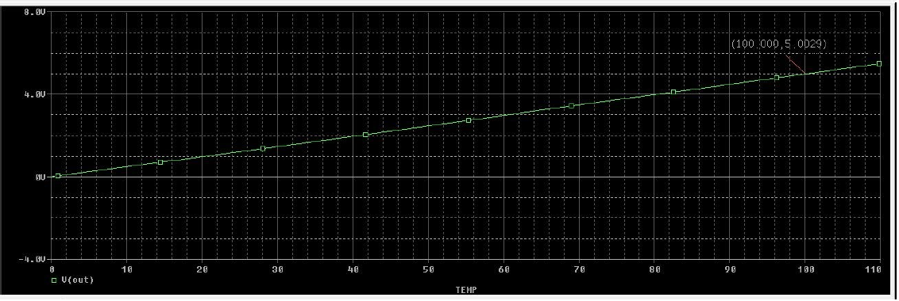
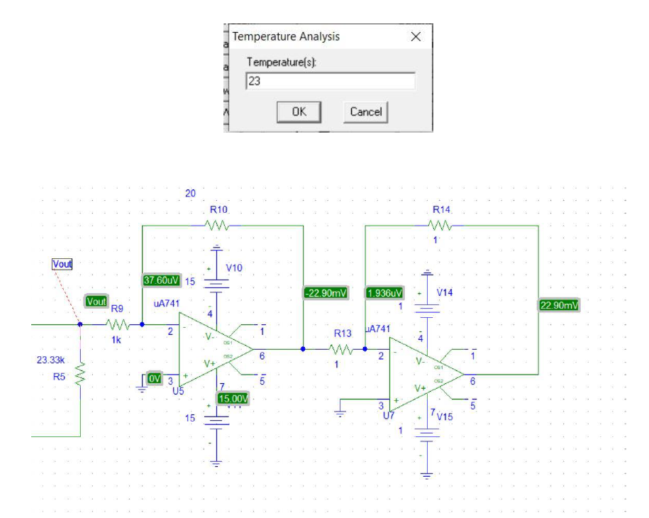

# Digital-Thermometer
 PSpice Project

Schematic Diagram

Temperature Sweep

From the plot, we observe the linear relationship between temperature and output voltage

Temperature Analysis

So we notice that the thermometer output is 22.90 degree celsius which is close to 23 degree celsius
